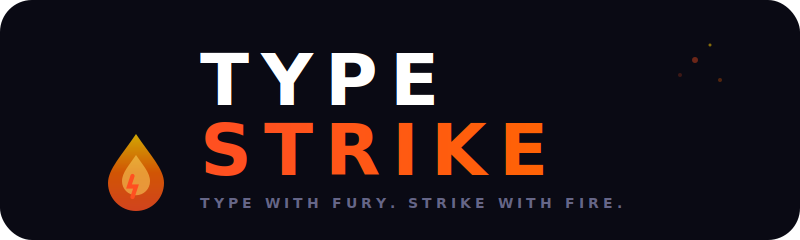

# ⚡ type-strike

<p align="center">
  
</p>

<p align="center">
  <strong>Type with fury. Strike with fire.</strong>
</p>

type-strike is a typing game that turns every word into an explosive arcade battle. No flat typing tests — just visceral feedback, liquid-fueled combos, and a journey through 500 levels of fire and fury.

> **Note:** The Android companion app (`type-strike-android/`) is currently on hold. Development is focused on the web frontend and Go backend. The Android project remains in the repo for future reference.

---

## 🎮 The Core Loop

You enter a dark, molten world — your progression map. Each node is a crystalline keycap waiting to be conquered. The countdown hits 3… 2… 1… GO! The arena ignites. Words appear in a scrollable panel. Correct keystrokes glow green; mistakes crack red. Build streaks across 6 combo tiers — from *Igniting* to *Max Frenzy* to *Ignition Speed*. Earn 1–3 stars based on WPM, accuracy, and error count. Advance through the tiers. Rise through 100+ levels.

---

## 🔥 Features

- **500 levels** across 5 ascending tiers (100 each): Ember → Igneous → Magma Core → Obsidian → Beyond
- **Level data fully database-driven** — paragraphs, thresholds, and names served from PostgreSQL
- **5 game modes** — Levels, Timed (1/3/5 min), Contest, and Coder (code & DSA)
- **Plasma combo engine** — 6 escalating tiers with visual effects
- **Coder mode** — type real multi-line code snippets across 7 languages (JS, TS, Python, Go, Java, C++, Rust)
- **Learn mode** — 48 progressive typing lessons with backend-tracked progress (persisted across sessions)
- **Daily challenges** — with streak multipliers, reward calendar, and bonus XP milestones
- **Streak system** — 30-day reward calendar with bonus XP at 5, 10, 15, 20, 25, and 30 days
- **Leaderboards** — Global (XP), Daily (today's best), and Timed (1min/3min/5min) rankings with stacked collapsible sections
- **Stats dashboard** — real player data: game history, level progress, activity feed, XP tracking, streak counter
- **Feats (achievements)** — achievements across speed, accuracy, combo, progression, and streaks
- **Gamified progression** — rank tiers (Bronze → Silver → Gold → Platinum → Diamond → Obsidian) with titles, themes, and tier upgrade celebrations
- **Dynamic share cards** — Open Graph images for social media
- **Custom keyboard themes** — unlock visual styles as you progress
- **Retry on failure** — automatic retry button when a game fails to load
- **Confetti celebrations** — canvas-based confetti burst on tier upgrades with unlockable titles & themes preview

---

## 🧭 Navigation

The app uses a **top navbar** (replaces the old left sidebar):

| Element | Description |
|---------|-------------|
| **Logo** | "TYPE STRIKE" wordmark — always visible |
| **Back button** | Arrow-left icon on all pages except homepage |
| **Profile / Auth** | User avatar or Sign In / Sign Up buttons |
| **Rank badge** | Shows rank name (e.g., RECRUIT), numeric rank (#42), and level |
| **Streak badge** | Current streak count with flame icon |

**Mobile**: Sticky bottom navigation bar with quick access to Strike, Learn, Coder, Leaderboard, and Profile.

## 🏠 Homepage Layout

The redesigned homepage is organized into clear sections:

1. **Hero** — Compact greeting with level badge, rank, and 3 primary actions: **Strike** (→ Levels), **Learn** (→ Lessons), **Coder** (→ Code snippets)
2. **Quick Links** — 4 compact cards: Leaderboard, Feats, Ranks (Bronze → Silver → Gold journey), Stats
3. **Streak Widget** — 30-day reward calendar with Today/Tomorrow/next days, bonus XP badges, and progress bar
4. **Stats Row** — Accuracy, Best WPM, Total XP, and current Rank
5. **Timed Contests** — Sprint (1min), Endurance (3min), Marathon (5min)

---

## 🗺️ The Journey

| Tier | Levels | Vibe |
|------|--------|------|
| **EMBER 🔥** | 1–100 | The beginning of flame |
| **IGNEOUS 🌋** | 101–200 | Forged in volcanic fire |
| **MAGMA CORE 🔴** | 201–300 | The planet's burning heart |
| **OBSIDIAN ⚫** | 301–400 | Only the fastest survive |
| **BEYOND 🌟** | 401–500 | The final frontier — mastery awaits |

---

## 🚀 Quick Start

```bash
./run.sh start              # Start both backend + frontend
./run.sh start --seed       # Start with level seeding
./run.sh stop               # Stop both servers
```

Or start each service manually:

```bash
cd backend && ./run.sh start --seed    # Go backend on :8080
cd type-strike-web && npm run dev      # Next.js frontend on :3000
```

---

## 🏛️ Project Structure

```
type-strike/
├── type-strike-web/          # Next.js frontend (React, TypeScript, Tailwind)
│   └── src/
│       ├── app/              # Next.js App Router pages
│       ├── components/       # Shared components
│       │   ├── layout/       # Navbar, BottomNav
│       │   ├── game/         # Gameplay components
│       │   ├── ui/           # Card, Button, GlassPanel, ProgressBar
│       │   ├── react-bits/   # Particles, SpotlightCard, ShinyText, BlurText
│       │   ├── effects/      # ParticleField, ConfettiAnimation
│       │   ├── achievements/ # AchievementToast
│       │   └── analytics/    # LiveStats, ConsistencyGraph
│       ├── hooks/            # usePlayer, useGameplay, useAchievements, etc.
│       ├── engine/           # Typing engine & interfaces
│       ├── lib/              # api, types, constants, lessons
│       └── styles/           # glass-effects.module.css
├── backend/                  # Go backend
│   ├── cmd/server/           # Entry point
│   ├── internal/             # Handlers, models, repository, database
│   └── scripts/              # Seed scripts
├── type-strike-android/      # Android app (Kotlin, Jetpack Compose)
├── docs/                     # Documentation (logo, strategy, database schema)
├── scripts/                  # Git hooks
└── .github/                  # CI workflows
```

---

## 📱 Platform

- **Web** — Next.js 16, React 19, TypeScript, Tailwind CSS 4
- **Backend** — Go, PostgreSQL, Chi router

> Android (Kotlin, Jetpack Compose) — currently on hold.

---

## Keyboard Themes

| Theme | Unlock At | Description |
|-------|-----------|-------------|
| 🔥 Magma | Default | Fiery red theme |
| ★ Molten Gold | 10 levels | Premium golden keys |
| ✦ Neon Pulse | 25 levels | Electric purple glow |
| ❄ Frost Strike | 50 levels | Chilling blue keys |
| ⚫ Obsidian Void | 75 levels | Dark prestige keys |
| 🌈 Prismatic Fury | 100 levels | All colors unlocked |

---

*Two thumbs. One goal. Every keystroke is a weapon.*
